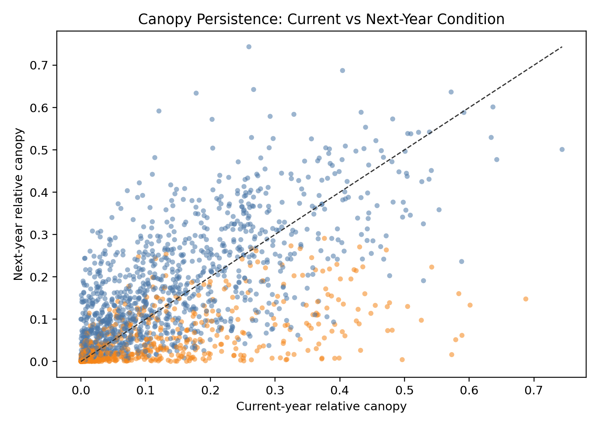
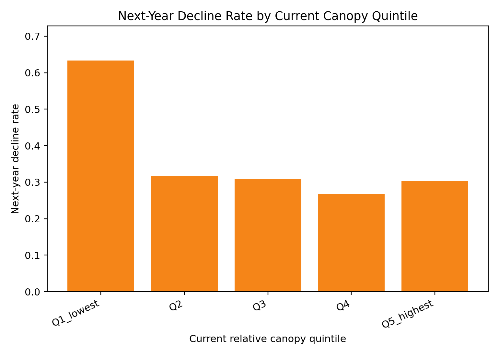
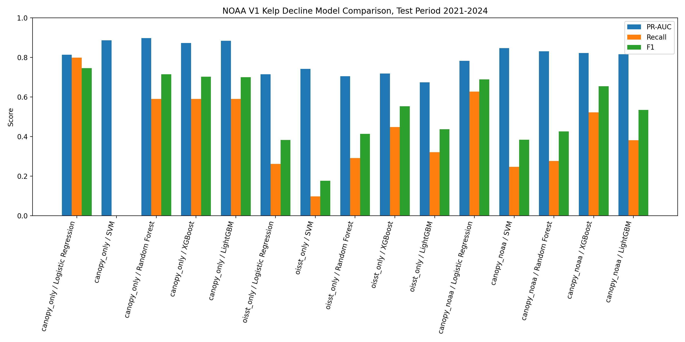
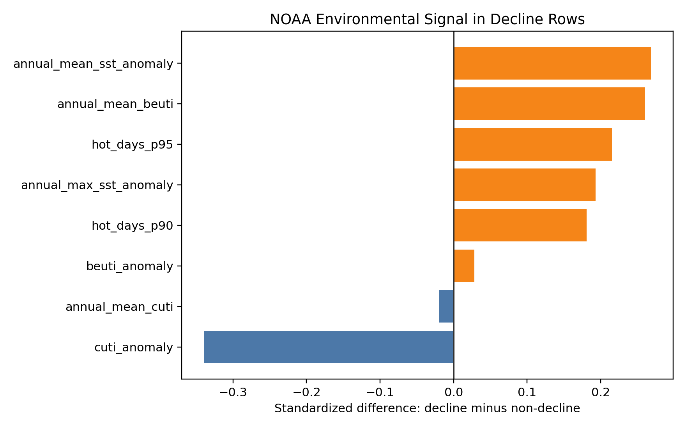
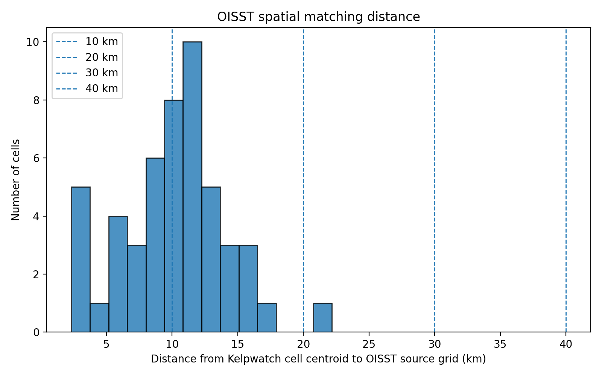
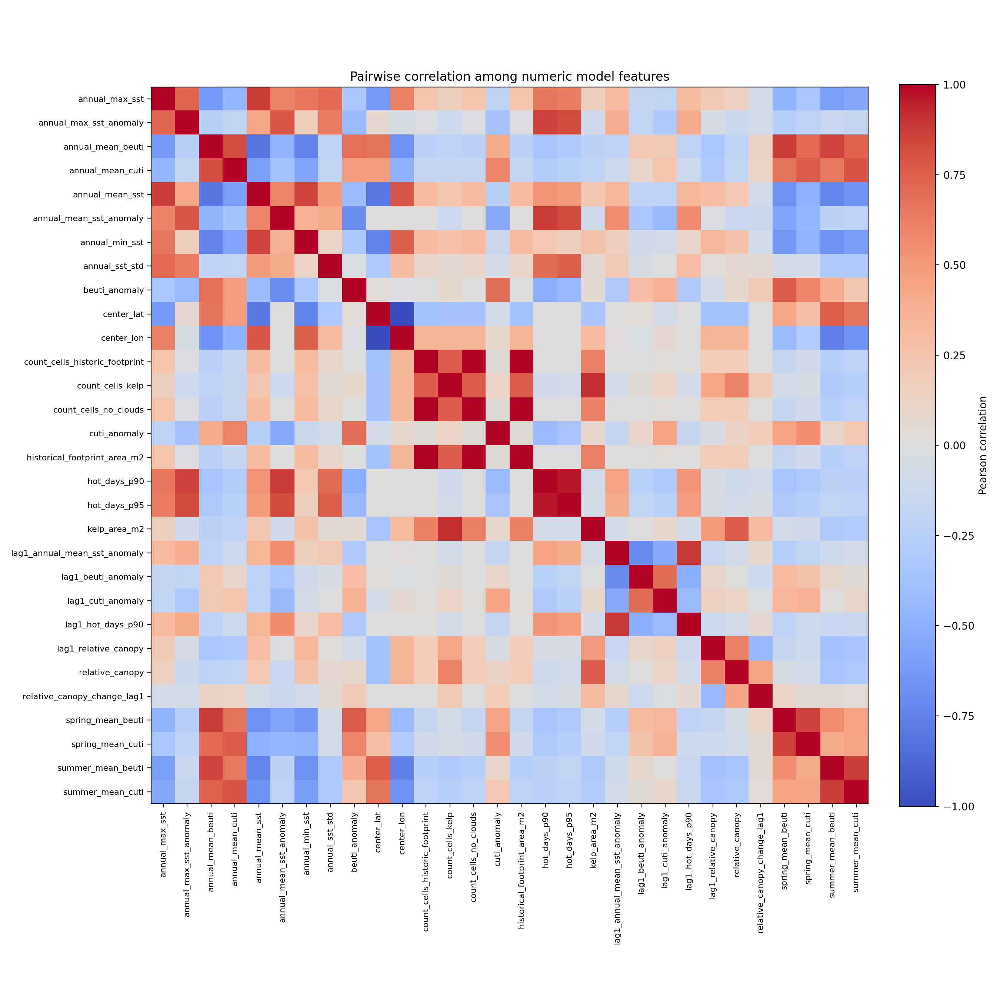
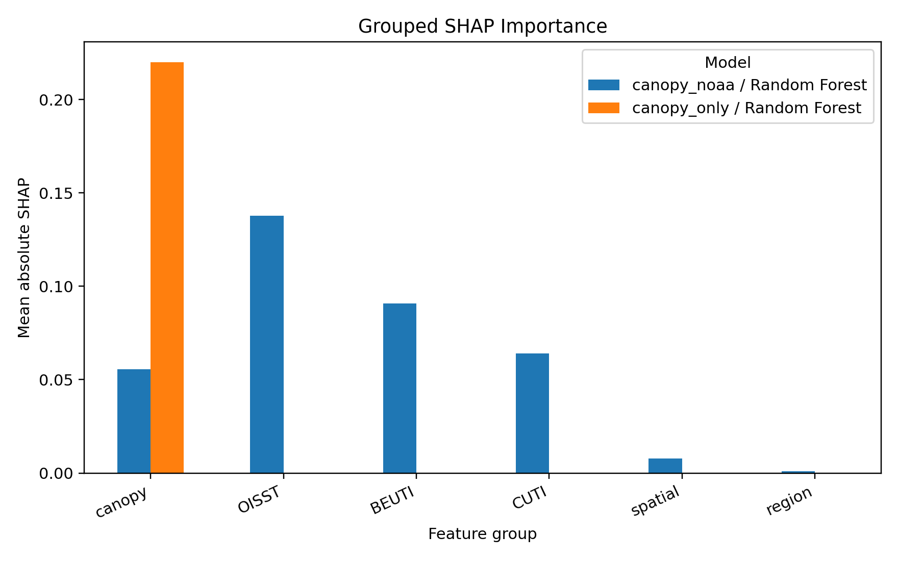

# Explainable Early-Warning Modeling for Kelp Canopy Decline Using Kelpwatch and NOAA Environmental Data

## Overview

This project builds a reproducible research-stage early-warning screening workflow for next-year kelp canopy decline. It combines Kelpwatch satellite-derived kelp canopy observations with NOAA environmental exposure indicators from OISST, CUTI, and BEUTI.

The workflow creates a 10 km fishnet cell-year dataset, constructs next-year decline labels, engineers NOAA thermal and upwelling-related proxy features, compares five supervised machine-learning models, and uses diagnostics plus SHAP interpretation to explain model behavior.

Main claim: this repository evaluates whether Kelpwatch satellite-derived kelp canopy time series and NOAA environmental covariates can support a recall-oriented early-warning screening workflow for next-year kelp canopy decline. The results suggest useful risk-state prediction performance, but stricter diagnostics show that near-low-canopy persistence contributes substantially to apparent full-sample performance.

## Research Questions

- Can satellite-derived kelp canopy time series define useful next-year decline events?
- How strongly does current canopy condition persist into next-year canopy condition?
- Do NOAA OISST, CUTI, and BEUTI exposure proxies add environmental context beyond direct canopy monitoring?
- How do model results change across linear, margin-based, random-forest, and boosted-tree classifiers?
- Can SHAP help separate biological-state signals from environmental-context signals without making causal claims?

## Data Sources

- **Kelpwatch:** satellite-derived kelp canopy area time series for user-defined AOIs.
- **NOAA OISST:** daily gridded sea surface temperature used for annual SST summaries, anomalies, and hot-day exceedance indicators.
- **NOAA CUTI:** coastal upwelling transport proxy.
- **NOAA BEUTI:** nitrate-flux proxy.

CUTI and BEUTI are interpreted as latitude-bin environmental exposure proxies. They are not cell-specific in situ nutrient measurements.

## Spatial Design

The study region is the Northern and Central California coastal corridor. Initial broad Kelpwatch regional exports were too coarse for cell-level early-warning modeling, so the project uses a regular 10 km x 10 km fishnet grid.

Current spatial design summary:

```text
Candidate fishnet cells: 285
Exploratory retained cells with count_cells_historic_footprint > 0: 74
Main modeling cells with count_cells_historic_footprint >= 500: 50
```

Each grid cell is uploaded to Kelpwatch as a single-feature GeoJSON because Kelpwatch accepts one feature per uploaded geometry. The GeoJSON AOIs and validation files are stored under:

```text
geometries/regular_10km_fishnet/
```

## Target Definition

The response variable is a next-year decline label:

```text
decline_event_next = 1
if next-year growing-season maximum relative canopy
falls below the cell-specific historical 25th percentile
```

The main baseline period is 1984-2013. The final year is excluded from label construction because next-year canopy is unavailable.

## NOAA Environmental Feature Engineering

Version 1 uses NOAA environmental predictors assigned to each 10 km Kelpwatch cell:

- OISST features are assigned using the nearest valid OISST ocean grid point to the cell centroid.
- CUTI and BEUTI features are assigned using the nearest available latitude bin.
- OISST anomalies and hot-day exceedance indicators use the 1984-2013 baseline period.

Example generated features include:

```text
annual_mean_sst
annual_max_sst
annual_min_sst
annual_sst_std
annual_mean_sst_anomaly
annual_max_sst_anomaly
hot_days_p90
hot_days_p95
lag1_annual_mean_sst_anomaly
lag1_hot_days_p90
annual_mean_cuti
cuti_anomaly
annual_mean_beuti
beuti_anomaly
lag1_cuti_anomaly
lag1_beuti_anomaly
```

`hot_days_p90` and `hot_days_p95` are hot-day exceedance indicators, not a full marine heatwave intensity analysis.

## Modeling Framework

The main modeling subset uses complete-feature years 1989-2024:

```text
Train: 1989-2016
Validation: 2017-2020
Test: 2021-2024
```

Five supervised classifiers were compared:

- Logistic Regression: transparent linear baseline.
- SVM: nonlinear margin-based classifier for a relatively small tabular dataset.
- Random Forest: robust nonlinear tree benchmark and SHAP-compatible model.
- XGBoost: boosted-tree benchmark.
- LightGBM: efficient boosted-tree benchmark.

Three feature sets were compared within each model class:

- `canopy_only`: direct biological state monitoring.
- `oisst_only`: thermal exposure variables alone.
- `canopy_noaa`: canopy state plus NOAA environmental exposure context.

Performance was evaluated using PR-AUC, recall, F1, F2, and false negatives because the task is framed as research-stage early-warning screening rather than balanced classification.

## Results

### 1. Canopy State Is a Strong Short-Term Signal



Current relative canopy was strongly associated with next-year canopy condition. The current-to-next-year relative canopy correlation was `0.610`, supporting the interpretation that canopy state has strong temporal persistence.



The lowest current-canopy quintile had the highest next-year decline rate (`0.633`), while the highest quintile had a lower decline rate (`0.303`). This helps explain why canopy-only models performed strongly.

### 2. Canopy-Only Models Performed Best in Aggregate Prediction



The best aggregate test PR-AUC came from `canopy_only / Random Forest`:

```text
PR-AUC: 0.8974
Recall: 0.5896
F1: 0.7149
False negatives: 55
```

The best canopy+NOAA PR-AUC came from `canopy_noaa / SVM`:

```text
PR-AUC: 0.8459
Recall: 0.2463
F1: 0.3837
False negatives: 101
```

Within the tested algorithms, canopy+NOAA did not improve PR-AUC over canopy-only. However, for SVM at the default threshold, canopy+NOAA improved recall and F1 and reduced false negatives relative to canopy-only SVM. OISST-only models were generally weaker than canopy-only models, while canopy+NOAA models generally improved over OISST-only models.

### Recall-Oriented Threshold Tuning

Because kelp decline prediction is framed as a recall-oriented screening task, the default `0.50` decision threshold may be too conservative. Thresholds were selected on the validation period and applied unchanged to the test period. This analysis evaluates whether false negatives can be reduced while preserving a reasonable precision-recall trade-off. Threshold tuning changes the classifier operating point; it does not change PR-AUC.

The main threshold-tuned model is `canopy_only / Random Forest` at threshold `0.30`, which balances high recall with reasonable precision:

```text
Selection role: main threshold-tuned model
Recall: 0.910
Precision: 0.753
F1: 0.824
F2: 0.874
False negatives: 12
Default-threshold false negatives: 55
```

The high-sensitivity screening scenario is `canopy_noaa / SVM` at threshold `0.05`. This setting achieves very high recall, but it uses a much lower threshold and may produce more warnings:

```text
Selection role: high-sensitivity screening scenario
Recall: 1.000
Precision: 0.670
F1: 0.802
F2: 0.910
False negatives: 0
Default-threshold false negatives: 101
```

The threshold analysis now reports five selection rules: default `0.50`, max F1, max F2, recall >= 0.70 then max F1, and max recall subject to precision >= 0.65. If the precision floor is too strict for a model, the rule falls back to precision >= 0.50 and records that fallback. These thresholds were selected using the 2017-2020 validation period only, then fixed for the 2021-2024 test period to avoid test-set leakage.

### Early-Warning Validity Diagnostics

An additional methodological robustness check evaluates whether model performance is partly driven by zero-state or near-zero-state persistence. This matters because a model can appear useful for early warning if it mostly identifies locations that are already degraded and likely to remain degraded, rather than detecting transition into future low-canopy conditions.

The diagnostic measures current-to-next-year canopy transitions using `relative_canopy` and `next_year_relative_canopy` under zero and near-zero thresholds:

```text
current_zero -> next_zero
current_zero -> next_nonzero
current_nonzero -> next_zero
current_nonzero -> next_nonzero
```

Exact zero-to-zero persistence was limited in this dataset, but near-zero persistence was substantial:

```text
Threshold 0.00: zero -> zero persistence = 0.143
Threshold 0.01: zero -> zero persistence = 0.630
Threshold 0.05: zero -> zero persistence = 0.669
Threshold 0.10: zero -> zero persistence = 0.746
```

At-risk subset evaluation shows that original-label performance declines when already-low canopy states are removed. For `current_canopy > 0.05`, the best original-label test result was `canopy_only / Random Forest`:

```text
PR-AUC: 0.633
Recall: 0.400
F1: 0.480
Positive events: 45 / 93
```

A stricter transition label was also tested:

```text
new_decline_event_next = 1
if current relative canopy is at or above the cell-specific 1984-2013 p25 baseline
and next-year relative canopy falls below that p25 baseline
```

This label captures transition into a low-canopy state rather than persistence of an already-low state. Under this stricter target, performance was more modest; the best full-sample PR-AUC was `0.401` for `canopy_only / Random Forest`, while at-risk PR-AUC values were generally in the `0.39-0.51` range depending on the threshold and model.

These diagnostics suggest that the current Version 1 model is strongest at detecting canopy-state persistence and already-low or near-low canopy conditions. There is some preliminary signal in at-risk and new-decline-transition settings, but the present results should be described as a research-stage early-warning validity evaluation rather than a deployed monitoring workflow.

### Naive Persistence Baseline and Early-Warning Validity Check

A stricter benchmark layer treats simple canopy-persistence rules as official baseline models. This check asks whether machine-learning models add useful early-warning information beyond rules that only encode current or recent canopy state.

The benchmark includes:

- cell-specific historical p25 persistence rule;
- fixed current-canopy low-state rule using `current_canopy < 0.05`;
- lag-1 low-state rule;
- recent declining trajectory rule;
- canopy-only Logistic Regression baselines.

These baselines were evaluated against the original `decline_event_next` label, at-risk original-label subsets, the stricter `new_decline_event_next` transition label, and the actionable `actionable_decline_drop_next` label. They were also tested for high-canopy subgroups, including `current_canopy > 0.05`, current canopy above the cell-specific historical p50, and current canopy above the historical p75.

For the full-sample original decline task, the best naive persistence baseline was nearly identical to the best ML model:

```text
Best naive baseline: B_fixed_low_canopy_005_rule
Naive PR-AUC: 0.893

Best ML model: canopy_only / Random Forest
ML PR-AUC: 0.897

ML minus naive PR-AUC: 0.004
```

For transition-oriented and actionable targets, machine-learning models did not clearly outperform naive persistence baselines under the high-canopy claim gate. The benchmark found:

```text
High-canopy transition/actionable comparisons evaluated: 8
High-canopy comparisons passing the claim gate: 0
```

This means the strongest current evidence is for canopy-state persistence and risk-state screening, not confirmed operational early warning before visible decline. High full-sample performance should not be interpreted as operational early-warning skill unless the model also outperforms simple canopy-persistence baselines under at-risk, high-canopy, and transition-oriented evaluation settings.

This repository therefore provides a persistence-aware diagnostic framework for separating apparent decline predictability from true early-warning signal.

### How to Interpret the Results

Full-sample PR-AUC can look strong because it includes persistent low-canopy states. At-risk subset performance is more relevant for early warning because it asks whether the model can identify future decline among locations that still have nonzero or moderate current canopy. The stricter `new_decline_event_next` label better captures new transition into low canopy, but it is harder to predict because it removes already-low persistence from the positive class.

High recall is important because missing actual decline events is costly in a screening workflow. Precision still matters because too many false alarms reduce practical usefulness. The most defensible interpretation is therefore that the model provides a reproducible robustness check for distinguishing preliminary early-warning signal from canopy-state persistence.

### Recall-Oriented Modeling Extensions

The next modeling extension adds cost-sensitive learning, actionable decline labels, canopy trajectory features, environmental stress interactions, feature-set ablations, and extended validation-based threshold tuning. The purpose is to improve recall-oriented risk screening while avoiding a trivial "predict everything as decline" result.

False negatives are costly in early-warning screening because missed decline events reduce the value of an alerting workflow. Class-weighted and positive-class-weighted models were added to increase sensitivity to decline events while keeping unweighted models as baselines. Threshold tuning is still selected on the 2017-2020 validation period and fixed on the 2021-2024 test period to avoid test-set leakage.

Two actionable labels were added:

```text
actionable_decline_low_next:
current_canopy > 0.05
and next_canopy < historical_25th_percentile

actionable_decline_drop_next:
current_canopy > 0.05
and proportional next-year canopy drop >= 0.30
```

These labels are more practical for actionable decline screening than the original label alone because they require currently observable canopy before a low-canopy or sharp-drop outcome. They are also less strict than `new_decline_event_next`, which only captures transition from at-or-above the historical p25 threshold into below-p25 canopy.

The extension also adds leakage-safe canopy trajectory features such as `canopy_lag1`, `canopy_lag2`, `canopy_2yr_change`, `canopy_3yr_slope`, `canopy_3yr_cv`, `canopy_drop_from_3yr_max`, and `years_since_last_high_canopy`. Environmental stress features include lagged SST anomaly, two-year SST anomaly mean, lagged hot-day exposure, lagged CUTI/BEUTI anomalies, and simple thermal-stress interactions.

Key results:

```text
Original decline label, default threshold:
Best F2 = 0.857
Model = canopy_current_only / Logistic Regression / cost_sensitive
Recall = 0.896
Precision = 0.732

Original decline label, balanced threshold tuning:
Model = canopy_current_only / XGBoost / unweighted
Threshold = 0.25
Recall = 0.813
Precision = 0.779
F2 = 0.806

Original decline label, high-sensitivity threshold tuning:
Model = canopy_current_only / LightGBM / unweighted
Threshold = 0.05
Recall = 1.000
Precision = 0.677
F2 = 0.913

Actionable drop label:
Best default-threshold F2 = 0.699
Model = canopy_trajectory_only / XGBoost / cost_sensitive

Actionable drop label, threshold tuned:
Model = canopy_current_plus_trajectory / SVM / cost_sensitive
Threshold = 0.20
Recall = 0.941
Precision = 0.516
F2 = 0.808
```

Trajectory features did not outperform current-canopy-only models for the original `decline_event_next` label, so the original full-sample task still appears strongly influenced by canopy-state persistence. However, trajectory features were useful for `actionable_decline_drop_next`, providing preliminary evidence that recent canopy trajectory can support actionable decline screening when the target is defined as a sharp future drop rather than persistence of already-low canopy.

### 3. NOAA Variables Provide Environmental Exposure Context



Decline rows showed directional differences in several NOAA variables. For example, `annual_mean_sst_anomaly` was higher in decline rows, while `cuti_anomaly` was lower. BEUTI-related signals also differed, but they should be interpreted cautiously as proxy-based and context-dependent.

NOAA variables are environmental exposure proxies. They provide context for interpreting decline risk but do not replace direct canopy monitoring and do not establish causal mechanisms.

### Environmental Covariate Quality Check

An additional environmental covariate diagnostic was added to test whether the current NOAA features are spatially and temporally precise enough to add incremental predictive value beyond canopy state. This matters because OISST, CUTI, and BEUTI are useful regional exposure proxies, but they are coarser than the nearshore 10 km Kelpwatch fishnet cells and may not capture local kelp stress processes.



The nearest valid OISST grid assignment produced a mean cell-to-source distance of `10.16 km`, a median distance of `10.63 km`, and a maximum distance of `22.18 km`. One retained cell was farther than `20 km` from its assigned OISST source grid, and no cells were farther than `40 km`.

A cached 3x3 OISST-neighborhood sensitivity check showed that nearest-grid and neighborhood-mean annual SST summaries were highly correlated, but not identical:

```text
Annual mean SST mean absolute difference: 0.071 deg C
Annual SST anomaly mean absolute difference: 0.026 deg C
Annual hot days p90 mean absolute difference: 2.65 days
Median annual SST correlation: 0.999
```

The incremental-value evaluation did not show a consistent improvement from adding current NOAA features to canopy-state variables in the full original-label task. The best full-sample recall-oriented result remained `canopy_current_only / Logistic Regression`, with recall `0.896`, F2 `0.856`, and PR-AUC `0.854`. Environment-only models retained some signal, but adding environment to canopy variables reduced recall in this Version 1 setup.

For at-risk observations with `current_canopy > 0.05`, the best result in this diagnostic was `environment_only / Logistic Regression`, with recall `0.556`, F2 `0.551`, and PR-AUC `0.554`. For stricter transition labels, performance remained modest. This suggests that NOAA variables provide useful environmental context and some screening signal, but the present Version 1 covariates should not be interpreted as a robust standalone early-warning system.

The most defensible conclusion is that current canopy state remains the strongest short-term predictor, while NOAA features are contextual exposure variables whose incremental value should be tested with finer sensitivity analyses. Future refinements should compare nearest-grid OISST against coastal-buffer averages, use event-window or seasonal stress metrics, and add local ecological covariates such as grazing, wave disturbance, disease context, and regional validation.

### Multicollinearity Diagnostic

Because the modeling dataset includes structurally related canopy variables and multiple NOAA-derived exposure summaries, a multicollinearity diagnostic was added before final feature interpretation. This diagnostic evaluates pairwise Pearson correlations, variance inflation factors (VIF), and condition numbers for the same feature sets used in the main model comparison.



The diagnostic found `19` feature pairs with `abs(r) >= 0.80`. The strongest redundancies were expected and structurally interpretable:

```text
count_cells_historic_footprint vs historical_footprint_area_m2: r = 1.000
count_cells_historic_footprint vs count_cells_no_clouds: r = 1.000
center_lat vs center_lon: r = -0.996
hot_days_p90 vs hot_days_p95: r = 0.963
count_cells_kelp vs kelp_area_m2: r = 0.910
```

VIF diagnostics also indicated strong multivariate redundancy. The `canopy_noaa` feature set had `25` high-VIF rows using the `VIF >= 10` threshold. Some infinite VIF values arise from exact linear relationships, such as current canopy, lagged canopy, and canopy change being included together.

This finding does not invalidate the tree-based screening models, but it changes how feature interpretation should be framed. Logistic Regression coefficients should be treated as transparent baseline behavior rather than definitive individual-variable effects. SHAP and feature-importance narratives should emphasize grouped evidence, such as canopy state, OISST thermal exposure, CUTI upwelling proxy, and BEUTI nitrate-flux proxy, instead of making strong claims about isolated correlated predictors.

### 4. SHAP Separates Biological-State Signals from Environmental-Context Signals



SHAP interpretation was performed on:

```text
canopy_only / Random Forest
canopy_noaa / Random Forest
```

Although SVM had the best canopy+NOAA PR-AUC, Kernel SHAP for SVM was not used because it can be slow and less stable. A Random Forest canopy+NOAA model was used for TreeExplainer-based interpretation.

Grouped SHAP importance showed:

- `canopy_only / Random Forest`: canopy-state variables accounted for `100%` of grouped SHAP importance.
- `canopy_noaa / Random Forest`: OISST, BEUTI, and CUTI variables carried substantial internal SHAP importance, while canopy variables remained part of the model explanation.

These SHAP values explain fitted model behavior, not ecological causality.

## V2: Multi-Scale Exposure Selection and Transition-Based Early Warning

This repository now includes a V2 analysis layer that treats spatial resolution as a modeling choice rather than a fixed preprocessing assumption. Environmental exposure variables are constructed at multiple spatial supports and evaluated using transition-oriented targets under temporal and region-holdout validation. This design is intended to distinguish actionable new kelp decline risk from persistence of already-low canopy states.

### Why Multi-Scale Exposure Is Needed

Version 1 used nearest-grid OISST assignment as the baseline. That is reproducible and efficient, but it creates a support mismatch: 10 km Kelpwatch cells are compared with coarse offshore/coastal OISST grid points. V2 therefore adds source-aware interpolated SST exposure and broader coastal-neighborhood buffer summaries.

For OISST, IDW is not treated as ordinary missing-value imputation. It is source-aware interpolation from a coarse 0.25-degree gridded SST field to kelp cell centroids. The resulting variables should be described as **IDW-interpolated OISST exposure at kelp-cell centroids**, not as true 10 km SST.

The V2 construction script builds OISST exposure summaries for:

```text
nearest grid
IDW k = 4 interpolation
IDW k = 8 interpolation sensitivity
bilinear interpolation, only if the cached OISST grid is complete and regular enough
10 km buffer
25 km buffer
30 km buffer
50 km buffer
75 km buffer
```

Distance and buffer operations are performed in projected CRS `EPSG:3310`, not by buffering raw latitude/longitude degrees. OISST grid cells are treated as point supports at their grid centroids. CUTI and BEUTI remain latitude-bin proxies in this V2 layer because they are not local radial-buffer measurements.

### Transition-Oriented Evaluation

The multi-scale comparison prioritizes targets that reduce false early-warning caused by canopy-state persistence:

- `decline_event_next`: original decline-state target.
- at-risk original target: original target evaluated only where `current_canopy > 0.05`.
- `new_decline_event_next`: transition from at-or-above the historical p25 threshold into below-p25 canopy.
- `actionable_decline_drop_next`: current canopy above 0.05 followed by at least a 30 percent next-year drop.

The default V2 multi-scale comparison excludes current canopy from the predictor set. This makes the environmental scale-selection experiment stricter because the model cannot rely directly on current canopy-state persistence. Current canopy can be added only when explicitly requested as a separate experiment.

### Multi-Scale Feature Construction

The current local V2 run generated:

| Scale | Feature columns | Rows | Mean OISST points | Min OISST points | Max OISST points |
|---|---:|---:|---:|---:|---:|
| nearest | 10 | 1,900 | 1.00 | 1 | 1 |
| IDW k=4 | 10 | 1,900 | 4.00 | 4 | 4 |
| IDW k=8 | 10 | 1,900 | 8.00 | 8 | 8 |
| 10 km | 9 | 1,900 | 1.00 | 1 | 1 |
| 25 km | 9 | 1,900 | 2.18 | 1 | 3 |
| 30 km | 9 | 1,900 | 2.58 | 1 | 4 |
| 50 km | 9 | 1,900 | 4.36 | 2 | 6 |
| 75 km | 9 | 1,900 | 6.46 | 2 | 9 |

The 10 km buffer is under-supported relative to the 0.25-degree OISST grid spacing and has substantial overlap with nearest-grid behavior. For this reason, IDW k=4 is used as the main practical interpolation method, IDW k=8 is retained as a sensitivity check, and 25/30/50/75 km buffers are interpreted as broader coastal-neighborhood exposure metrics. Bilinear interpolation was not included in the current run because the cached OISST grid was not complete enough around all kelp cells (`0` complete cells, `50` incomplete cells).

### Multi-Scale Model Comparison

The V2 comparison evaluates:

- `M0`: nearest-grid baseline.
- `M1`: IDW k=4 main practical interpolation.
- `M2`: IDW k=8 sensitivity, plus bilinear only if the cached grid is complete and regular enough.
- `M3`: 25/30/50/75 km buffer models as broader coastal-neighborhood exposure metrics.
- `M4`: multi-scale selected models using L1-regularized Logistic Regression and Random Forest.

The feature set is deliberately compact to reduce multicollinearity:

```text
annual_mean_sst_anomaly
hot_days_p90
lag1_hot_days_p90
cuti_anomaly
beuti_anomaly
```

The best temporal results from the current V2 environment-only run were:

| Target | Best comparison | Scale | Model | PR-AUC | Recall | Precision | F1 | Balanced accuracy |
|---|---|---|---|---:|---:|---:|---:|---:|
| Original decline state | `M3_buffer_25km` | 25 km | Logistic Regression L2 | 0.807 | 0.813 | 0.665 | 0.732 | 0.490 |
| At-risk original target | `M0_nearest_grid_baseline` | nearest | Random Forest | 0.741 | 0.267 | 0.923 | 0.414 | 0.623 |
| New decline transition | `M3_buffer_75km` | 75 km | Random Forest | 0.282 | 0.192 | 0.313 | 0.238 | 0.565 |
| Actionable decline drop | `M3_buffer_50km` | 50 km | Logistic Regression L2 | 0.387 | 1.000 | 0.183 | 0.309 | 0.542 |

The transition and actionable-drop targets are harder than the original decline-state label. Lower performance under these labels is scientifically meaningful because these labels reduce the influence of already-low or persistent low-canopy states.

### Scale-Selection Interpretation

Scale selection is reported as **multi-scale exposure selection**, not discovery of one universal optimal resolution. Candidate scales are summarized using a combined decision rule that considers PR-AUC, recall, fold/design stability, balanced accuracy, Brier score, and ecological interpretability.

The current combined rule selected:

| Target | Candidate scale |
|---|---|
| Original decline state | 30 km |
| At-risk original target | nearest |
| New decline transition | 75 km |
| Actionable decline drop | nearest |

This should be interpreted as a prototype scale-selection result. Thermal stress, upwelling, dispersal, grazing, wave exposure, and disease processes may operate at different spatial supports.

### V2 Limitations

- OISST is still a coarse offshore/coastal thermal proxy.
- IDW-interpolated OISST exposure reduces nearest-grid dependence but does not create true 10 km SST or true nearshore in-situ temperature.
- Buffer aggregation reduces nearest-grid sensitivity but does not create true nearshore in-situ temperature.
- The 10 km buffer is under-supported relative to 0.25-degree OISST grid spacing; it is tracked as a diagnostic support rather than emphasized as a main model scale.
- The current local OISST cache was designed for the Version 1 nearest-grid workflow, so a full publication-grade buffer run should cache all grid points intersecting each buffer.
- Multi-scale selection can be unstable when the number of retained kelp cells or transition events is small.
- At-risk transition prediction is harder than canopy-state prediction, so lower performance is expected and scientifically meaningful.
- Biological drivers such as urchin grazing, predator loss, disease, wave disturbance, and local restoration activity remain outside the coarse climate-only model unless added in a second-stage ecological case study.

## CRW 5 km SST Candidate Exposure Layer

This repository now includes an implemented NOAA Coral Reef Watch 5 km monthly-composite SST exposure layer as a higher-resolution satellite SST alternative to NOAA OISST. This addition does not remove the existing OISST V1/V2 workflow. Instead, it provides a direct sensitivity test of whether a less coarse SST product improves at-risk and transition-oriented kelp decline prediction.

The daily CRW point-cache path was tested first, but full 1985-2024 daily point extraction was too slow in the current environment. The monthly ERDDAP bbox path was also inconsistent for full-period extraction. The implemented workflow therefore streams predictable NOAA STAR monthly NetCDF files, extracts only retained Kelpwatch cell points, writes a compact point-level monthly cache, and deletes raw NetCDF files unless `--keep-raw-cache` is explicitly used.

The implemented monthly-composite CRW feature family includes:

```text
annual_mean_sst_crw5km
spring_mean_sst_crw5km
summer_mean_sst_crw5km
warmest_month_mean_sst_crw5km
annual_mean_ssta_crw5km
spring_ssta_crw5km
summer_ssta_crw5km
annual_max_monthly_ssta_crw5km
lag1 versions of the above features
```

Spatial matching is defined as:

- baseline: nearest valid CRW 5 km ocean grid cell to each Kelpwatch 10 km cell centroid;
- diagnostics: `distance_to_crw_grid_km`, source monthly filenames, and extraction status;
- compact extracted cache: `data/external/noaa/cache/crw5km_composites/extracted/crw5km_monthly_points_extracted.csv`.

The completed composite run produced:

```text
Monthly file pairs successfully processed: 444
Extracted monthly point rows: 22,200
Annual CRW feature rows built: 1,800
Unique Kelpwatch cells: 50
Mean CRW feature missingness: 0.0000
Mean nearest-grid distance: 2.815 km
Max nearest-grid distance: 7.720 km
Computed model-comparison rows: 40
```

Tracked CRW composite outputs:

```text
results/tables/crw5km_composite_feature_diagnostics.csv
results/tables/crw5km_composite_model_comparison.csv
outputs/diagnostics/crw5km_composite_feature_report.md
```

Best PR-AUC results by target in the CRW composite comparison were:

```text
original_decline: canopy_only / Random Forest, PR-AUC 0.879
at_risk_original_gt005: canopy_only / Random Forest, PR-AUC 0.602
new_decline_transition: canopy_only / Logistic Regression L2, PR-AUC 0.407
actionable_decline_drop: canopy_only / Logistic Regression L2, PR-AUC 0.579
```

CRW composite features improved over OISST-only for the original broad decline target (`0.828` versus `0.714` PR-AUC for the best CRW-only and OISST-only rows). However, CRW composite features did not improve over OISST-only or canopy-only for the at-risk original, new-transition, or actionable-drop targets in this run. This supports a cautious interpretation: CRW 5 km monthly composites add useful SST exposure sensitivity, but they do not by themselves solve the harder transition-oriented early-warning problem.

CRW 5 km SST should be treated as a higher-resolution satellite SST exposure layer, not true local in-situ nearshore temperature. Composite features summarize monthly mean SST and SSTA, so they cannot fully reproduce daily hot-day counts, cumulative heat stress, or short marine-heatwave duration metrics.

## Static Bathymetry and Habitat Covariates

The repository now includes a static bathymetry and habitat-context layer inspired by kelp persistence and decline studies. The purpose is to test whether physical habitat setting helps explain where canopy decline risk, thermal exposure, or persistence patterns are more likely to occur.

The implemented workflow uses a small GEBCO 2026 California coastal subset downloaded through the GEBCO grid subsetting API. Raw GEBCO zip and NetCDF files are temporary by default and are not committed. GEBCO elevation is converted to positive ocean depth using:

```text
depth_m = -elevation_m
for ocean pixels where elevation_m < 0
```

Coastal cells can include land, so summaries are computed over valid ocean pixels only. The workflow records `ocean_pixel_share` and `bathymetry_missing_rate` to diagnose support and coverage.

Generated habitat features include:

```text
mean_depth_m
min_depth_m
max_depth_m
depth_range_m
shallow_area_share_0_30m
shallow_area_share_0_50m
slope_mean
slope_std
n_bathymetry_pixels_used
ocean_pixel_share
bathymetry_missing_rate
```

The completed run produced:

```text
Retained cells with habitat features: 50 / 50
Mean ocean pixel share: 0.526
Mean bathymetry missing rate: 0.000
Mean depth: 76.80 m
Mean shallow 0-30 m share: 0.311
Mean shallow 0-50 m share: 0.511
Computed model-comparison rows: 68
```

Tracked habitat outputs:

```text
results/tables/bathymetry_habitat_feature_diagnostics.csv
results/tables/bathymetry_habitat_model_comparison.csv
outputs/diagnostics/bathymetry_habitat_feature_report.md
```

Best PR-AUC results from the habitat comparison were:

```text
original_decline: naive persistence baseline, PR-AUC 0.893
at_risk_original_gt005: habitat_only / Logistic Regression L2, PR-AUC 0.764
new_decline_transition: canopy + OISST + habitat / Logistic Regression L2, PR-AUC 0.408
actionable_decline_drop: canopy + OISST + habitat / Logistic Regression L2, PR-AUC 0.619
```

Habitat-only performance was strong for the original broad decline target and the at-risk original target. This suggests that static physical setting contains useful spatial risk-screening information. However, habitat-only performance remained weak for the stricter new-transition target, and improvements on broad decline labels should not be interpreted as operational early-warning skill.

Bathymetry and habitat features are static covariates, not direct biological drivers. They represent habitat suitability and exposure context rather than grazing pressure, disease, recruitment, or direct ecological mechanisms. No future target information is used in these features.

## Canopy Trajectory and Instability Proxy Features

The repository now includes a leakage-safe canopy trajectory feature layer. This layer is a diagnostic extension of the persistence baseline, not an environmental driver layer. It asks whether recent canopy history, trend, and time-series instability improve prediction of at-risk or transition-oriented decline.

For each cell-year `t`, all trajectory features use only observations from year `t` and earlier. The leakage audit stores `trajectory_max_source_year_used` for every generated feature row and verifies:

```text
trajectory_max_source_year_used <= year
```

The completed audit passed with `0` violating rows. The first year where all trajectory features are available in the full panel is `1988`, so the main 1989-2024 modeling period has complete trajectory coverage.

Generated canopy trajectory features include:

```text
canopy_current_t
canopy_lag1
canopy_lag2
canopy_3yr_mean_t
canopy_5yr_mean_t
canopy_3yr_slope_t
canopy_5yr_slope_t
canopy_cv_5yr_t
years_since_last_high_canopy_t
years_since_last_low_canopy_t
recent_decline_rate_3yr_t
recent_recovery_rate_3yr_t
instability_score_5yr_t
presence_frequency_5yr_t
```

The rolling windows are defined strictly:

```text
3-year window: t, t-1, t-2
5-year window: t, t-1, t-2, t-3, t-4
```

`instability_score_5yr_t` is a time-series instability proxy based on mean absolute annual canopy change. It is not true spatial fragmentation because patch geometry is not used.

The completed run produced:

```text
Feature rows built: 1,800
Cells represented: 50
Model-period years: 1989-2024
Maximum feature missingness: 0.0000
Leakage audit: passed
Computed model-comparison rows: 75
```

Tracked canopy trajectory outputs:

```text
results/tables/canopy_trajectory_feature_diagnostics.csv
results/tables/canopy_trajectory_model_comparison.csv
outputs/diagnostics/canopy_trajectory_feature_report.md
```

Best PR-AUC results from the trajectory comparison were:

```text
original_decline: naive persistence baseline, PR-AUC 0.893
at_risk_original_gt005: habitat_only / Logistic Regression L2, PR-AUC 0.764
new_decline_transition: canopy trajectory + CRW + habitat / Logistic Regression L2, PR-AUC 0.419
actionable_decline_drop: existing canopy-only / Logistic Regression L2, PR-AUC 0.579
high_canopy_original_decline: canopy trajectory + habitat / Logistic Regression L2, PR-AUC 0.657
```

Trajectory-only features improved the at-risk original target relative to the existing canopy-only feature set (`0.650` versus `0.602` PR-AUC). They did not improve the original broad decline target, the stricter new-transition target, or the actionable-drop target by PR-AUC. For actionable decline, trajectory-only Random Forest reduced false negatives compared with existing canopy-only Random Forest (`6` versus `16`), but it did not beat the best existing canopy-only PR-AUC.

The interpretation is therefore cautious: canopy trajectory features mainly refine persistence-based risk-state screening. They provide some useful at-risk signal and can reduce false negatives under some operating points, but they do not yet establish robust true transition or actionable early-warning skill.

## Second-Stage Framework

The recommended interpretation is a two-stage GeoAI workflow:

```text
Stage 1: 10 km regional screening
Kelpwatch canopy + NOAA climate/upwelling proxies
identify broad transition-risk hotspots

Stage 2: local ecological diagnosis
30 m Landsat/Kelpwatch patches
local survey data on urchins, sea stars, predators, substrate, disease, waves, and restoration
spatial join only within Stage 1 hotspots
```

Stage 2 is a proposed extension, not an implemented result in the current repository.

## V3 Candidate: Ecological Transition Case Study

The V1/V2 results suggest that climate-only and canopy-state models have limited true early-warning performance for high-canopy abrupt transitions. Full-sample decline prediction is strongly affected by canopy-state persistence, while transition-oriented and actionable-drop targets are harder. This motivates a biologically richer Stage-2 case study focused on local ecological drivers of abrupt kelp collapse.

Candidate local drivers include purple sea urchin grazing pressure, predator loss, sea star wasting disease, wave exposure, substrate, restoration history, and interactions between marine heatwave exposure and grazer pressure. The purpose of this V3 direction is not to claim improved performance yet. It is to test whether adding site-level ecological monitoring data makes the transition problem more biologically meaningful.

### Candidate Ecological Data Sources

| Dataset | Spatial coverage | Temporal coverage | Likely variables | Access method | Coordinates available | Join to Kelpwatch 10 km cells | Pre-collapse / collapse / post-collapse support | Limitations |
|---|---|---|---|---|---|---|---|---|
| [BCO-DMO purple sea urchin density](https://www.bco-dmo.org/dataset/541003) | California coast, roughly 37.8-39.3 N from Andrew Molera State Park to Manchester State Park | 2005-2014 | Purple urchin density or counts, site, year, survey metadata | BCO-DMO dataset page | Likely site coordinates or site locations; verify after download | Join survey sites to nearest or intersecting Kelpwatch 10 km cells | Useful pre-collapse and early collapse context | Ends in 2014, so post-collapse analysis is limited |
| [BCO-DMO / CDFW kelp forest monitoring](https://www.bco-dmo.org/dataset/927682) | Sonoma-Mendocino Coast, northern California | 1999-2023 in BCO-DMO subset; broader ongoing program also appears in OPC/DataONE | Organism counts, algal habitat cover, substrate cover, lengths, site, depth | BCO-DMO and OPC/DataONE repository products | Yes or likely available for monitoring locations; verify precision | Strong candidate for spatial join to Kelpwatch cells or local canopy buffers | Best first candidate for pre-collapse, collapse, and post-collapse analysis | Requires harmonizing multiple ecological tables and uneven survey years |
| [California open data kelp forest transect surveys](https://data.ca.gov/dataset/kelp-forest-transect-surveys-sonoma-and-mendocino-county-northern-california-coast) | Sonoma and Mendocino counties; rocky reefs from 0-60 ft depth | Verify package year coverage after download | 30 x 2 m transect observations, depth, site, species or habitat measurements | California open data / CNRA package | Expected, but must be checked from files | Strong candidate, likely aligned with northern California monitoring products | Likely useful if years span the 2014-2016 collapse window | Package may contain multiple CSV/PDF/RTF files needing schema harmonization |
| [Reef Check California Kelp Forest Monitoring Program](https://www.reefcheck.org/kelp-forest-program/kelp-forest-monitoring-and-mpas/) | California coast, with recent expansion to Oregon and Washington | Program began in 2006; 2024 data available by request according to Reef Check | Fish, invertebrate, kelp, substrate, and site survey indicators | Data request workflow | Likely site coordinates after access approval | Potentially strong for broader California extension | Could support broader validation beyond Sonoma-Mendocino | Access request and protocol harmonization are blockers |
| [PISCO kelp forest monitoring](https://piscoweb.org/kelp-forest-study) | California and Oregon rocky-bottom kelp forest sites | Continuous monitoring since 1999 | Macroalgae, invertebrate, fish density/biomass, site, depth, survey protocol fields | PISCO data access and related DataONE/OBIS products where available | Likely site coordinates, subject to access product | Potentially strong for central/southern California and MPA comparisons | Useful for broader ecological covariate design | Access and schema may vary by institution or product |

### Proposed V3 Modeling Design

Candidate targets:

- `abrupt_canopy_drop_next`: currently observable canopy followed by a sharp next-year relative canopy drop.
- `healthy_to_low_transition`: current canopy above a cell or site historical healthy threshold followed by low canopy.
- `post_heatwave_collapse_indicator`: transition into low canopy during or after a marine heatwave/event period.

Candidate features:

- marine heatwave intensity from OISST;
- IDW-interpolated or buffer OISST heat stress;
- urchin density or urchin count;
- sea star, predator, or community proxy if available;
- interaction term: heatwave intensity x urchin density;
- year fixed effects or event-period indicators.

Recommended scope: start with a Northern California / Sonoma-Mendocino ecological transition case study rather than a full California model. This scope aligns with long-term kelp forest monitoring, the documented bull kelp collapse period, and the current Kelpwatch V1 region. A full California ecological model should wait until Reef Check, PISCO, and regional survey schemas are harmonized.

The recommended interpretation is that the climate-only model is a regional screening layer. A biologically meaningful early-warning study should focus on abrupt transitions in monitored kelp forest sites where urchin density and predator/community data can be joined to Kelpwatch canopy trajectories.

## Reproducible Workflow

The completed workflow is:

1. Northern/Central California 10 km fishnet spatial design.
2. Kelpwatch cell export and validation.
3. Historical-footprint cell filtering.
4. Annual growing-season maximum canopy panel construction.
5. Next-year decline label construction.
6. NOAA OISST + CUTI/BEUTI feature engineering.
7. Final modeling dataset validation.
8. Five-model comparison.
9. Threshold tuning.
10. Zero-persistence and at-risk validity diagnostics.
11. Naive persistence baseline benchmark.
12. Recall-oriented modeling extensions.
13. Environmental covariate quality-control and sensitivity diagnostics.
14. Multicollinearity diagnostics.
15. V2 multi-scale environmental exposure construction.
16. V2 transition-based multi-scale exposure selection.
17. CRW 5 km SST candidate exposure feasibility, monthly-composite extraction, and comparison layer.
18. Static GEBCO bathymetry and habitat-context covariates.
19. Leakage-safe canopy trajectory and time-series instability proxy features.
20. Model diagnostics.
21. Canopy persistence and environmental-context analysis.
22. SHAP interpretation.
23. Within-model feature-set comparison.
24. V3 ecological data feasibility scan.

Main scripts:

```bash
python scripts/filter_kelpwatch_cells.py
python scripts/build_kelpwatch_panel.py
python scripts/construct_decline_labels.py
python scripts/build_noaa_environmental_features.py
python scripts/train_model_comparison.py
python scripts/tune_decision_thresholds.py
python scripts/diagnose_zero_persistence.py
python scripts/11_naive_persistence_baseline_benchmark.py
python scripts/run_recall_oriented_modeling_extensions.py
python scripts/diagnose_environmental_covariates.py
python scripts/diagnose_multicollinearity.py
python scripts/09_build_multiscale_environmental_features.py
python scripts/10_multiscale_exposure_selection.py
python scripts/16_build_crw_5km_sst_features.py
python scripts/16a_download_crw5km_point_cache.py
python scripts/16b_build_crw5km_composite_features.py
python scripts/17_build_bathymetry_habitat_features.py
python scripts/19_build_canopy_trajectory_features.py
python scripts/14_ecological_data_feasibility_scan.py
python scripts/diagnose_model_results.py
python scripts/analyze_canopy_environment_context.py
python scripts/interpret_models_shap.py
```

Run `python scripts/diagnose_zero_persistence.py` after the main modeling pipeline and threshold tuning, but before final interpretation. This makes the final narrative distinguish risk-state prediction, near-low-canopy persistence, and stricter transition-into-decline performance.

Run `python scripts/11_naive_persistence_baseline_benchmark.py` after zero-persistence diagnostics to compare ML results against official naive canopy-persistence baselines. This benchmark gates early-warning claims by testing whether ML models outperform simple current-canopy, lagged-canopy, and recent-trajectory rules under at-risk, high-canopy, transition, and actionable target settings.

Run `python scripts/run_recall_oriented_modeling_extensions.py` after the validity diagnostics when testing cost-sensitive models, actionable labels, trajectory features, environmental stress interactions, and extended threshold tuning.

Run `python scripts/diagnose_environmental_covariates.py` after NOAA feature construction and recall-oriented diagnostics to evaluate OISST matching distance, nearest-grid versus cached 3x3 OISST sensitivity, seasonal/window environmental features, and incremental environmental value across full-sample, at-risk, transition, and actionable labels.

Run `python scripts/diagnose_multicollinearity.py` before coefficient-level or feature-importance interpretation. This records correlation, VIF, and condition-number diagnostics so individual-feature explanations can be framed cautiously when predictors are redundant.

Run `python scripts/09_build_multiscale_environmental_features.py` and `python scripts/10_multiscale_exposure_selection.py` to reproduce the V2 multi-scale exposure construction and transition-oriented scale-selection tables. The processed multi-scale feature file is ignored by Git and should be regenerated locally from the NOAA cache.

Run `python scripts/16_build_crw_5km_sst_features.py` to build or plan the optional daily CRW CoralTemp 5 km SST exposure layer. If local CRW daily point-cache files are unavailable, the script runs in dry-run mode and writes access requirements plus not-run diagnostics instead of fabricating feature or model results. Run `python scripts/16a_download_crw5km_point_cache.py` only as an optional long-run/HPC daily-cache path.

Run `python scripts/16b_build_crw5km_composite_features.py` to reproduce the implemented CRW monthly-composite workflow. This script streams NOAA STAR monthly NetCDF files, extracts retained Kelpwatch cell points, writes a compact local extracted cache, deletes raw NetCDF files by default, builds annual/seasonal CRW features, and compares CRW composite, OISST, combined, and canopy feature families.

Run `python scripts/17_build_bathymetry_habitat_features.py` to reproduce the static GEBCO bathymetry and habitat-context workflow. This script downloads a small GEBCO subset through the GEBCO queue API unless a local NetCDF is supplied, computes ocean-only depth and slope summaries for retained 10 km cells, deletes raw GEBCO files by default, and compares habitat, SST, canopy, and combined feature families.

Run `python scripts/19_build_canopy_trajectory_features.py` to reproduce the leakage-safe canopy trajectory workflow. This script builds lagged canopy, rolling mean, slope, recovery/decline, time-series instability, and presence-frequency proxy features using only years up to and including year `t`, writes an explicit leakage audit, and compares trajectory features against naive persistence, existing canopy-only, CRW composite, habitat, and combined feature families.

Run `python scripts/14_ecological_data_feasibility_scan.py` to regenerate the V3 ecological data feasibility report. This script does not download ecological data or change V1/V2 models; it documents candidate urchin, kelp forest monitoring, and community survey datasets for a future Stage-2 ecological transition case study.

Raw Kelpwatch exports, processed datasets, and NOAA cache files are intentionally ignored by Git. The repository tracks scripts, GeoJSON AOIs, validation metadata, diagnostic reports, selected model-result summaries, `results/tables/`, reproducibility reports, and figures.

`outputs/diagnostics/` contains zero-persistence transition tables, at-risk subset evaluation, stricter new-decline label performance, naive persistence baseline reports, CRW 5 km SST feasibility and composite-extraction reports, bathymetry/habitat feature reports, canopy trajectory leakage-audit reports, ecological data feasibility planning, actionable-label summaries, environmental covariate QC reports, OISST matching-distance diagnostics, and diagnostic plots/reports. `outputs/model_results/` contains compact model-result outputs such as threshold tuning grids, threshold-selection summaries, cost-sensitive model comparisons, actionable-label performance, environmental incremental-value diagnostics, and feature-ablation results.

## Repository Structure

```text
kelp-decline-early-warning/
├── README.md
├── requirements.txt
├── data/
│   ├── raw/
│   ├── processed/
│   └── external/
├── geometries/
│   └── regular_10km_fishnet/
├── scripts/
├── docs/
│   └── maps/
├── notebooks/
├── results/
│   └── tables/
├── src/
└── outputs/
    ├── figures/
    ├── diagnostics/
    ├── maps/
    ├── metadata/
    └── model_results/
```

## Setup

Create and activate a Python virtual environment:

```bash
python -m venv .venv
source .venv/bin/activate
pip install -r requirements.txt
```

Use Python 3.10-3.13. The SHAP dependency stack currently pulls `numba`, which does not support Python 3.14.

Environment check:

```bash
python -c "import pandas, sklearn, xgboost, lightgbm, shap; print('OK')"
```

On macOS, if importing XGBoost or LightGBM fails with `libomp.dylib` missing, install OpenMP:

```bash
brew install libomp
```

## Limitations

- Small number of retained modeling cells (`50` main cells).
- Limited final test years (`2021-2024`).
- The temporal split does not fully test spatial generalization.
- OISST uses nearest valid ocean-grid assignment in Version 1.
- The cached 3x3 OISST sensitivity check is an intermediate diagnostic, not a full coastal-buffer average.
- CRW 5 km monthly composites provide an implemented higher-resolution SST exposure sensitivity layer, but they do not reproduce daily hot-day counts or cumulative heat-stress metrics.
- GEBCO bathymetry/habitat variables are static spatial covariates and should be interpreted as habitat/exposure context, not direct ecological drivers or operational early-warning signals.
- Canopy trajectory and instability features are time-series persistence diagnostics, not true spatial fragmentation metrics.
- CUTI/BEUTI use nearest latitude-bin assignment.
- Seasonal and annual NOAA features may miss short event windows and local nearshore stress processes.
- No direct cell-level nutrient measurements are included.
- No grazing, urchin, sea star wasting disease, or direct biotic pressure variables are included.
- Environmental interpretation is proxy-based.
- The workflow supports early-warning screening, not causal attribution.
- Early-warning validity depends on separating transition-into-decline skill from persistence of already-low or near-zero canopy states.
- Multi-scale exposure selection is a prototype sensitivity layer until all OISST grid points intersecting each candidate buffer are cached and evaluated.

## Future Work

- Test spatial or grouped cross-validation, including leave-region-out validation.
- Expand the V2 buffer workflow to a complete OISST point cache for every candidate buffer.
- Compare nearest-grid OISST assignment with complete coastal-buffer average sensitivity analyses.
- Use the optional CRW daily point-cache path or an HPC workflow to test daily hot-day and cumulative heat-stress metrics against the monthly-composite CRW layer.
- Test whether bathymetry/habitat gains persist under spatial or leave-region-out validation before interpreting them as robust spatial risk-screening covariates.
- Add ecological covariates such as grazing pressure, urchin observations, wave disturbance, and disease context where available.
- Estimate uncertainty using bootstrap confidence intervals for model metrics.
- Develop an optional Streamlit dashboard only if it can be polished and connected to tracked reproducibility outputs.

## References

References for spatial scale, support mismatch, validation design, Kelpwatch, and NOAA OISST are listed in [`refs.bib`](refs.bib).
